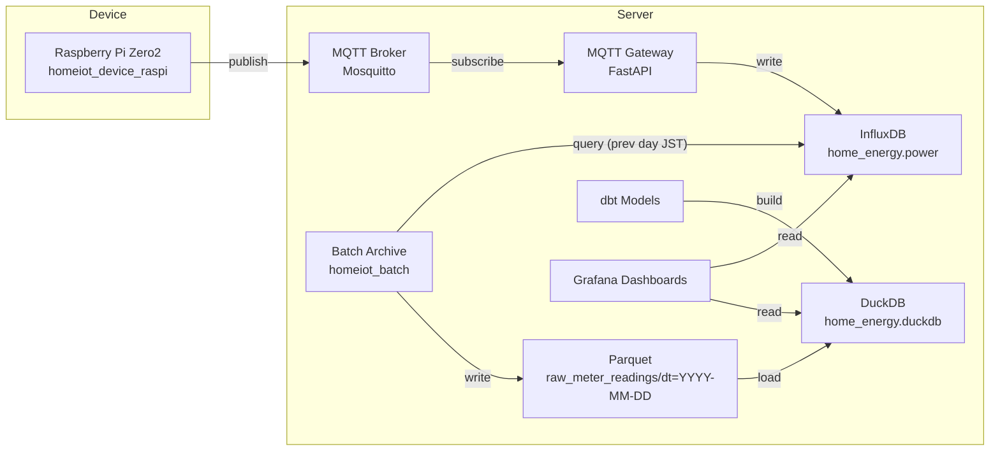

# Home IoT

Raspberry Pi と VPS の両方を 1 リポジトリで管理するための最小構成です。

## アーキテクチャ



```
home-iot/
  README.md
  device/
    main.py            # ラズパイ用のエントリポイント
    pyproject.toml     # uv や pip で使う依存定義
    .env.sample        # momonga / InfluxDB の設定例
  server/
    docker-compose.yml # VPS 上で起動するスタック
    app/
      Dockerfile
      app.py           # API（FastAPI）サンプル
    .env.sample        # InfluxDB / MQTT などの設定例
```

## Device (Raspberry Pi)

```
cd device/raspi-zero2
cp .env.sample .env          # Bルートや InfluxDB の接続設定を書き換える
uv sync                      # もしくは: pip install -r <generated requirements>
uv run python -m homeiot_device_raspi.main
```

### 主な環境変数

- `RBID`, `B_ROUTE_PWD`, `DEVICE`: momonga でスマートメーターへ接続するための B ルート情報
- `MQTT_BROKER_URL`, `MQTT_TLS_CA_CERT`, `MQTT_TOPIC`: MQTT publish 先の設定

### systemd で常駐させる

1) `.env` を作成し、`uv sync` まで済ませた上で、systemd のユニットを追加します。

```
sudo tee /etc/systemd/system/homeiot-device.service >/dev/null <<'EOF'
[Unit]
Description=HomeIoT Raspberry Pi Device
After=network-online.target
Wants=network-online.target

[Service]
Type=simple
User=pi
Group=pi
WorkingDirectory=/home/pi/home-iot/device/raspi-zero2
EnvironmentFile=/home/pi/home-iot/device/raspi-zero2/.env
Environment=PATH=/home/pi/.local/bin:/usr/local/bin:/usr/bin:/bin
Environment=PYTHONUNBUFFERED=1
ExecStart=/home/pi/.local/bin/uv run python -m homeiot_device_raspi.main
Restart=always
RestartSec=10

[Install]
WantedBy=multi-user.target
EOF
```

2) サービスを有効化して起動します。

```
sudo systemctl daemon-reload
sudo systemctl enable --now homeiot-device.service
```

- 停止: `sudo systemctl stop homeiot-device.service`
- 自動起動も止める: `sudo systemctl disable homeiot-device.service`
- ログ確認: `journalctl -u homeiot-device.service -f`
- パスやユーザーは環境に合わせて変更してください（例: `WorkingDirectory`, `ExecStart`）。

## Server (VPS)

```
cd server
cp .env.sample .env           # パスワードやポートを上書き
docker compose up -d
```

- `app/` は独自の API コンテナを置く場所です（FastAPI の最小実装を同梱）。
- `docker-compose.yml` はアプリと一緒に InfluxDB・MQTT ブローカーを公式イメージで起動します。

任意の VPS 上で `docker compose logs -f` でログを確認しつつ、必要になったら DB バックアップ先やボリューム名を調整してください。
