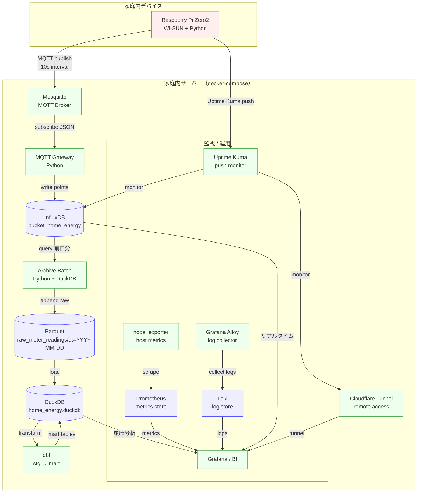

# Home IoT

家庭内スマートメーター（Bルート）から電力データを取得し、
MQTT・時系列 DB・分析用 DB を組み合わせて可視化・分析する
**IoT × データ基盤の個人実験用リポジトリ**です。

Raspberry Pi（デバイス）と VPS / 自宅サーバー（サーバー）の両方を
**1 リポジトリで管理**することを前提にしています。

---

## Features

- Bルート対応スマートメーターからの電力データ取得（10 秒周期）
- MQTT を介した疎結合なデバイス／サーバー構成
- InfluxDB（短期）＋ DuckDB / Parquet（長期）の二層ストレージ構成
- Grafana によるリアルタイム・履歴の統合可視化
- Uptime Kuma によるデバイス死活監視
- 観測・運用を含めた「家庭内データ基盤」の構築

---

## Architecture



---
## Repository Structure

Raspberry Pi 側（device）とサーバー側（server）を
役割ごとに分離して管理しています。

```
home-iot/
  README.md
  device/
    main.py            # ラズパイ用のエントリポイント
    pyproject.toml     # uv や pip で使う依存定義
    .env.sample        # momonga / InfluxDB の設定例
  server/
    docker-compose.yml # VPS 上で起動するスタック
    app/
      Dockerfile
      app.py           # API（FastAPI）サンプル
    .env.sample        # InfluxDB / MQTT などの設定例
```

---

## Quick Start（概要）

### Device（Raspberry Pi）

* スマートメーターから電力データを取得し、MQTT に publish
* systemd による常駐実行を想定

👉 詳細手順は [`docs/device.md`](docs/device.md) を参照してください。

---

### Server（VPS / 自宅サーバー）

* MQTT Broker / InfluxDB / Grafana などを docker-compose で起動
* 観測・可視化・長期保存を担当

👉 詳細手順は [`docs/server.md`](docs/server.md) を参照してください。

---

### Observability

* Node Exporter + Prometheus によるホスト監視
* Loki + Alloy によるログ収集
* Uptime Kuma によるデバイス生存監視

👉 詳細は [`docs/observability.md`](docs/observability.md)

---


