# Home IoT

家庭内スマートメーター（Bルート）から電力データを取得し、
MQTT・時系列 DB・分析用 DB を組み合わせて可視化・分析する
**IoT × データ基盤の個人実験用リポジトリ**です。

Raspberry Pi（デバイス）と VPS / 自宅サーバー（サーバー）の両方を
**1 リポジトリで管理**することを前提にしています。

---

## Features

- Bルート対応スマートメーターからの電力データ取得（10 秒周期）
- MQTT を介した疎結合なデバイス／サーバー構成
- InfluxDB（短期）＋ DuckDB / Parquet（長期）の二層ストレージ構成
- Grafana によるリアルタイム・履歴の統合可視化
- Uptime Kuma によるデバイス死活監視
- 観測・運用を含めた「家庭内データ基盤」の構築

---

## Architecture

```mermaid
%%{init: {'theme': 'dark'}}%%
flowchart TB
  classDef db fill:#eef,stroke:#55f,stroke-width:1px
  classDef svc fill:#efe,stroke:#5a5,stroke-width:1px
  classDef dev fill:#fee,stroke:#f55,stroke-width:1px

  subgraph Device["家庭内デバイス"]
    RPI["Raspberry Pi Zero2<br/>Wi-SUN + Python"]:::dev
  end

  subgraph HomeServer["家庭内サーバー（docker-compose）"]
    MQTT["Mosquitto<br/>MQTT Broker"]:::svc
    GW["MQTT Gateway<br/>Python"]:::svc
    Influx[("InfluxDB<br/>bucket: home_energy")]:::db
    Batch["Archive Batch<br/>Python + DuckDB"]:::svc
    Parquet[("Parquet<br/>raw_meter_readings/dt=YYYY-MM-DD")]:::db
    Duck[("DuckDB<br/>home_energy.duckdb")]:::db
    DBT["dbt<br/>stg → mart"]:::svc

    subgraph Observability["監視 / 運用"]
      NodeExporter["node_exporter<br/>host metrics"]:::svc
      Prometheus["Prometheus<br/>metrics store"]:::db
      Loki["Loki<br/>log store"]:::db
      Alloy["Grafana Alloy<br/>log collector"]:::svc
      UptimeKuma["Uptime Kuma<br/>push monitor"]:::svc
      Grafana["Grafana / BI"]:::svc
    end

    Cloudflared["Cloudflare Tunnel<br/>remote access"]:::svc
  end

  RPI -->|"MQTT publish<br/>10s interval"| MQTT
  MQTT -->|"subscribe JSON"| GW
  GW -->|"write points"| Influx
  RPI -->|"Uptime Kuma push"| UptimeKuma

  Influx -->|"query 前日分"| Batch
  Batch -->|"append raw"| Parquet
  Parquet -->|"load"| Duck
  Duck -->|"transform"| DBT
  DBT -->|"mart tables"| Duck

  Influx -->|"リアルタイム"| Grafana
  Duck -->|"履歴分析"| Grafana
  NodeExporter -->|"scrape"| Prometheus
  Prometheus -->|"metrics"| Grafana
  Alloy -->|"collect logs"| Loki
  Loki -->|"logs"| Grafana
  Cloudflared -->|"tunnel"| Grafana
  UptimeKuma -->|"monitor"| Influx
  UptimeKuma -->|"monitor"| Cloudflared
```



---
## Repository Structure

Raspberry Pi 側（device）とサーバー側（server）を
役割ごとに分離して管理しています。

```
home-iot/
  README.md
  AGENTS.md           # リポジトリ運用ガイドライン
  docker-compose.yml  # HomeServer スタック起動用
  data/               # ローカルデータ置き場
  docs/               # ドキュメント
  device/
    raspi-zero2/
      pyproject.toml   # デバイス側依存定義
      .env.sample      # Wi-SUN / MQTT / InfluxDB 設定例
      src/
        homeiot_device_raspi/
          main.py      # ラズパイ用エントリポイント
  server/
    mqtt_gateway/
      Dockerfile
      pyproject.toml   # Gateway 依存定義
      src/
        homeiot_mqtt_gateway/
          main.py      # FastAPI エントリポイント
    batch/
      Dockerfile
      pyproject.toml   # バッチ依存定義
      src/
        homeiot_batch/
          run_archive.py # Influx -> Parquet 変換
    grafana/
      dashboards/      # ダッシュボード定義
      provisioning/    # データソース/ダッシュボード設定
    config/
      mosquitto/       # MQTT ブローカー設定
      prometheus/      # Prometheus 設定
      loki/            # Loki 設定
      alloy/           # Grafana Alloy 設定
```

---

## Quick Start（概要）

### Device（Raspberry Pi）

* スマートメーターから電力データを取得し、MQTT に publish
* systemd による常駐実行を想定

👉 詳細手順は [`docs/device.md`](docs/device.md) を参照してください。

---

### Server（VPS / 自宅サーバー）

* MQTT Broker / InfluxDB / Grafana などを docker-compose で起動
* 観測・可視化・長期保存を担当

👉 詳細手順は [`docs/server.md`](docs/server.md) を参照してください。

---

### Observability

* Node Exporter + Prometheus によるホスト監視
* Loki + Alloy によるログ収集
* Uptime Kuma によるデバイス生存監視

👉 詳細は [`docs/observability.md`](docs/observability.md)

---
